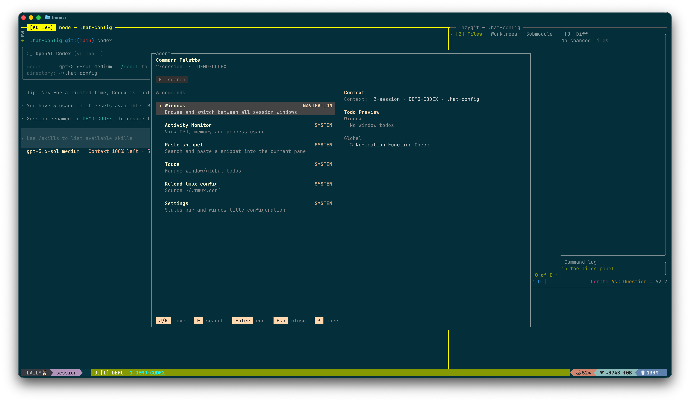

# Hat Config — tmux + AI agent 终端工作台

**简体中文** · [English](./README.en.md)

> **说明：** 这是我个人的配置库，因此很可能会基于个人需要频繁更新。我不一定能及时
> （甚至不一定能）受理 issue。推荐的用法是基于本仓库做你自己的自定义修改——本项目
> 采用 MIT 协议，可以随意修改。

面向终端的个人 tmux 工作流，用来驱动 AI 编码 agent（Claude Code、Codex、Grok Build
及自定义 provider）：为每个 agent 开一个三 pane 窗口（agent / git / run），由一个小型 Go
daemon 自动命名并追踪这些窗口的状态，在 tmux 状态栏呈现 ⏳/🔔 任务状态与桌面通知，
还能在崩溃后快照 / 恢复整个 workspace。Client 探测经 `internal/agentclient` Adapter
注册表；没有人工 Session Name 的新会话可由 Codex Luna（DeepSeek Flash fallback）生成短名：Claude/Codex 通过 adapter 写回原生名称，Grok 在尚无可靠外部 rename API 时保存 tracker 别名。窗口名按「原生 Session Name > tmux 自定义名 > tracker 生成名 > agent 默认标题」仲裁（见 `docs/ARCHITECTURE.md`「Agent Adapter」）。

所有能力都通过 `scripts/deploy.sh`（或上层的 `scripts/setup` 向导）接入真实 tmux
环境，也可干净卸载。



## 运行要求

仅支持 macOS。daemon 依赖 launchd、Carbon（输入源切换）与 `lsappinfo`，因此
Linux / Windows 不在支持范围内。

安装路径硬编码为 `~/.hat-config`（见 `agent-tracker/internal/paths/paths.go`——
二进制、socket、运行时状态都落在该目录下）。请把仓库 clone 到那里：

```bash
git clone <repo-url> ~/.hat-config
```

依赖（由 `scripts/setup` 检测）：

| 依赖 | 类型 | 最低版本 | 用途 |
|---|---|---|---|
| `tmux` | 必需 | 3.3 | 状态栏 + agent 窗口布局 |
| `go` | 必需 | — | 构建 agent-tracker daemon |
| `fzf` | 必需 | — | 模糊选择器（`prefix [`、`tmux-resume`） |
| `jq` | 必需 | — | JSON 配置合并 + `--json` 输出 |
| `z` | 可选 | — | 目录历史跳转（`prefix [`） |
| `lazygit` | 可选 | — | git TUI pane |
| `terminal-notifier` | 可选 | — | 桌面通知（缺失则仅响铃） |
| `gh` | 可选 | — | GitHub CLI 辅助 |

可选依赖缺失只降级对应能力；必需依赖缺失则中止安装。

## 侵入面（Installation footprint）

部署会改动仓库之外的六处，每处都是独立、可跳过的步骤（对应下方 `--skip-*` 开关），
卸载会逐一还原：

1. **Managed tmux block** —— 在 `~/.tmux.conf` 追加一段
   `# >>> hat-config managed tmux … <<<` 块，`source-file` 本仓的 `tmux/tmux.conf`。
2. **launchd daemon** —— `app.hat-tmux-workbench.agent-tracker` LaunchAgent，运行
   tracker daemon（窗口命名、任务状态、通知）。
3. **launchd workspace 定时器** —— `app.hat-tmux-workbench.workspace-save`
   LaunchAgent，每 180s 自动快照 workspace。
4. **Claude Stop hook** —— 合并进 `~/.claude/settings.json` 的 `Stop` hook
   （抓取 Claude session id 供 workspace 恢复）。
5. **Claude statusLine** —— 在 `~/.claude/settings.json` 注册 `statusLine`，指向
   本仓的 `claude_statusline.sh`。
6. **Shell alias** —— 在 `~/.hat-env/shared/alias-common` 添加 `agent` /
   `tmux-resume` 别名（若该文件不存在，则改写入 `~/.zshrc` 的 managed block）。

## 快速开始

运行 setup 向导：检查依赖、选图标集与键位预设、披露六处侵入点，再交给 `deploy.sh`：

```bash
~/.hat-config/scripts/setup
```

它也支持非交互模式（CI 安全；非交互下所有侵入步骤默认跳过，需显式 opt-in）。用下面
命令查看完整 flag 列表：

```bash
~/.hat-config/scripts/setup --help
```

## 手动安装

`deploy.sh` 可脱离向导直接使用：

```bash
~/.hat-config/scripts/deploy.sh install --yes   # 安装 / 更新（同一路径）
~/.hat-config/scripts/deploy.sh status          # 查看部署状态
```

六个侵入步骤各自可独立跳过，这些开关对 install / uninstall 对称生效：

```bash
--skip-tmux        # managed tmux block
--skip-daemon      # agent-tracker launchd daemon
--skip-ws-timer    # workspace 自动存档 launchd 定时器
--skip-stop-hook   # Claude Stop hook
--skip-statusline  # Claude statusLine 注册
--skip-alias       # agent / tmux-resume shell 别名
```

### AI 部署

想让 agent 替你部署，先把它指向机读契约。一句话指令模板：

> 运行 `~/.hat-config/scripts/setup agent-guide` 读取部署契约（flags、决策点、JSONL
> 输出 schema），再以你想启用的侵入点的显式 `--<step>=install` flag 运行
> `~/.hat-config/scripts/setup --non-interactive --json`，并回报结果里的
> `{"result": …}` 行。

`agent-guide` 只输出静态 JSON 契约，不执行任何侵入动作。

## 私有 overlay

机器本地与个人文件放在一个 gitignore 的 overlay 里，让公开仓保持干净：包括
`private/`（例如 setup 键位模块产出的 `private/keymap.conf`，以及个人文档）、仓根的
`CLAUDE.md`、`.tasks/`、`snippets/private/` 与 `snippets/.favorites`、以及
`agent-tracker/agent-config.json`。这些永不提交，由向导和 daemon 就地读取。

> **警告：** `git clean -fdx` 会删除 gitignore 的文件——它会抹掉你**整个**私有
> overlay（键位、个人 snippet、CLAUDE.md、tasks）。执行任何破坏性 clean 前先备份
> overlay（例如 Syncthing 版本历史或个人备份）；若只想清理未跟踪文件，优先用不带
> `-x` 的 `git clean -fd`。

## 卸载

```bash
~/.hat-config/scripts/deploy.sh uninstall --yes --keep-state
```

它会反向还原全部六处（移除 managed tmux block、bootout 两个 launchd job、剥离
Claude Stop hook 与 statusLine、删除 shell 别名）。`--keep-state` 保留
`~/.hat-config/state/` 下的运行时状态，`--remove-state` 则删除。

## 文档

- [docs/GUIDE.md](./docs/GUIDE.md) —— 完整工作流指南（含嵌套 SSH tmux）。
- [docs/GUIDE_TMUX.md](./docs/GUIDE_TMUX.md) —— tmux 基础、键位，以及 keymap.conf
  定制预设。
- [docs/GUIDE_TIMER_SNIPPET.md](./docs/GUIDE_TIMER_SNIPPET.md) —— 定时器面板 +
  snippet 内容库。
- [docs/GUIDE_WORKSPACE.md](./docs/GUIDE_WORKSPACE.md) —— workspace 快照 / 恢复。
- [docs/ARCHITECTURE.md](./docs/ARCHITECTURE.md) —— daemon + tmux 架构（维护者）。

运行时状态写入 `~/.hat-config/state/`，不提交到 git。
